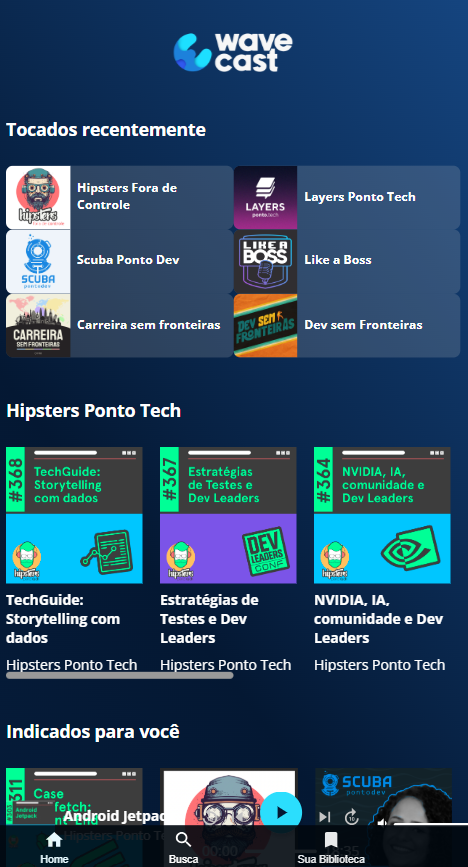
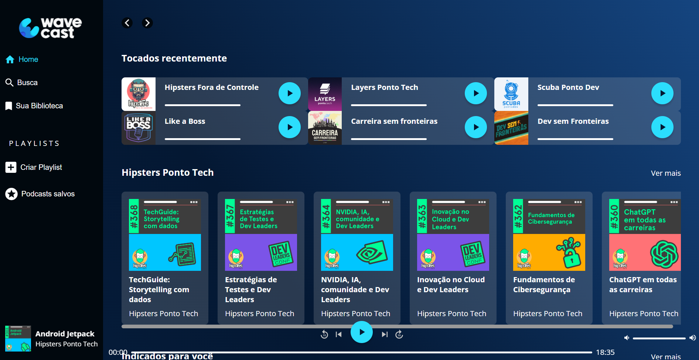
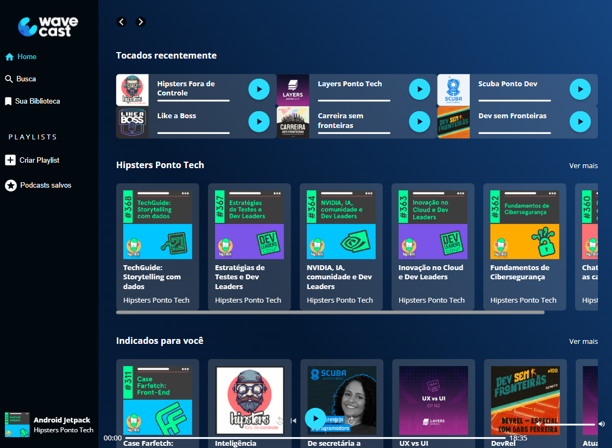

# AluraPlay

## ℹ️ Sobre

Projeto utilizado no curso para aprendizado das técnicas e melhores práticas.

## 📘Ementa

### CSS: construindo layouts com Grid

- Identificar as principais caracteristicas de um layout baseado em grid
- Implementar valores para as alturas das linhas e larguras das colunas
- Modificar o alinhamento vertical e horizontal dos elementos
- Calcular o espaçamento vertical e horizontal entre os elementos
- Integrar as propriedades do grid para tornar o layout responsivo
- Construir páginas complexas da web com grid container e grid item
- Criar elementos como cards, menus e barra de rolagem com grid

## 🖥️ Tecnologias

  
  

## 🧑‍🏫 Instrutor(es)

| [ Luan Alves](https://www.linkedin.com/in/luanalvesdev/) |
| :---------------------------------------------------------------------------------------------------------------------------------------------------------------------------------------------------------------------------------------------------------------------------------------------------------------------------: |

## 💻 Screenshot

#### Mobile

  
  
  #### Tablet
  
  
  #### Desktop
  

